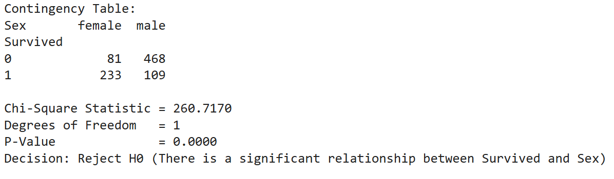
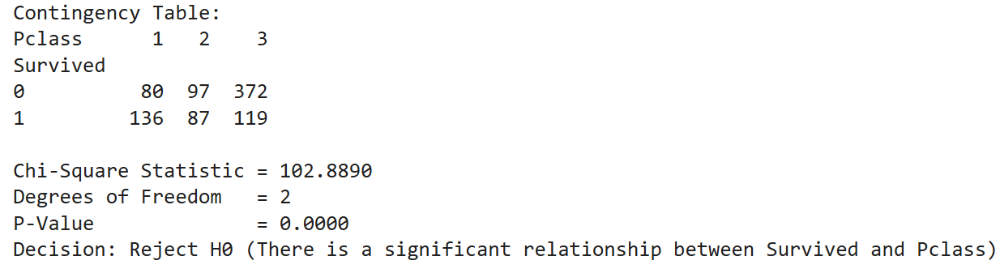

# Chi-Square Test of Independence | Titanic Dataset

## Overview

This project applies the **Chi-Square Test of Independence** to the Titanic dataset to determine whether passenger survival was statistically associated with categorical variables.

The analysis investigates two questions:

- Is passenger survival associated with gender?
- Is passenger survival associated with passenger class?

The notebook demonstrates how hypothesis testing can be used to determine whether observed differences between categorical variables are statistically significant.

---

# Objective

The primary objectives of this project are to:

- Understand the relationship between categorical variables.
- Apply the Chi-Square Test of Independence using Python.
- Interpret statistical significance using p-values.
- Draw meaningful conclusions from real-world data.

---

# Dataset

**Dataset:** Titanic Dataset

The dataset contains passenger information including:

- Survival Status
- Passenger Class
- Gender
- Age
- Fare

For this analysis, only the following variables were used:

| Variable | Description |
|----------|-------------|
| Survived | Survival status (0 = No, 1 = Yes) |
| Sex | Passenger gender |
| Pclass | Ticket class (1st, 2nd, 3rd) |

---

# Statistical Concepts

This notebook demonstrates:

- Contingency Tables
- Chi-Square Test of Independence
- Null & Alternative Hypothesis
- Degrees of Freedom
- Expected Frequencies
- P-value Interpretation
- Statistical Decision Making

---

# Methodology

The workflow consists of the following steps:

1. Load the Titanic dataset.
2. Create contingency tables using `pandas.crosstab()`.
3. Apply the Chi-Square Test using SciPy.
4. Calculate:

   - Chi-Square Statistic
   - Degrees of Freedom
   - P-value

5. Compare the p-value against the significance level (α = 0.05).
6. Accept or reject the null hypothesis.

---

# Analysis Performed

## 1. Survival vs Gender

The first analysis evaluates whether survival rates differed between male and female passengers.

### Output

### Results

| Metric | Value |
|--------|------:|
| Chi-Square Statistic | 260.72 |
| Degrees of Freedom | 1 |
| P-value | < 0.001 |

### Interpretation

The p-value is significantly smaller than the chosen significance level (0.05), indicating a statistically significant relationship between passenger gender and survival.

Female passengers survived at substantially higher rates than male passengers.

---

## 2. Survival vs Passenger Class

The second analysis evaluates whether passenger class influenced survival.

### Output

### Results

| Metric | Value |
|--------|------:|
| Chi-Square Statistic | 102.89 |
| Degrees of Freedom | 2 |
| P-value | < 0.001 |

### Interpretation

The analysis shows a statistically significant association between passenger class and survival.

Passengers traveling in higher classes experienced higher survival rates than those in lower classes.

---

# Key Findings

- Passenger survival was strongly associated with gender.
- Passenger class also showed a statistically significant relationship with survival.
- Both hypothesis tests produced p-values far below the significance threshold (α = 0.05).
- The Chi-Square Test successfully identified meaningful relationships between categorical variables.

---

# Skills Demonstrated

### Python

- Pandas
- SciPy

### Statistics

- Chi-Square Test
- Hypothesis Testing
- P-value Interpretation
- Contingency Tables

### Data Analysis

- Data Exploration
- Categorical Data Analysis
- Statistical Inference

---

# Technologies Used

- Python
- Pandas
- SciPy
- Jupyter Notebook

---

# Conclusion

This project demonstrates the practical application of the Chi-Square Test of Independence using real-world passenger data from the Titanic dataset.

The analysis shows that both passenger gender and ticket class were statistically associated with survival outcomes. Beyond performing the statistical test, the project emphasizes proper hypothesis formulation, interpretation of p-values, and translating statistical results into meaningful conclusions.