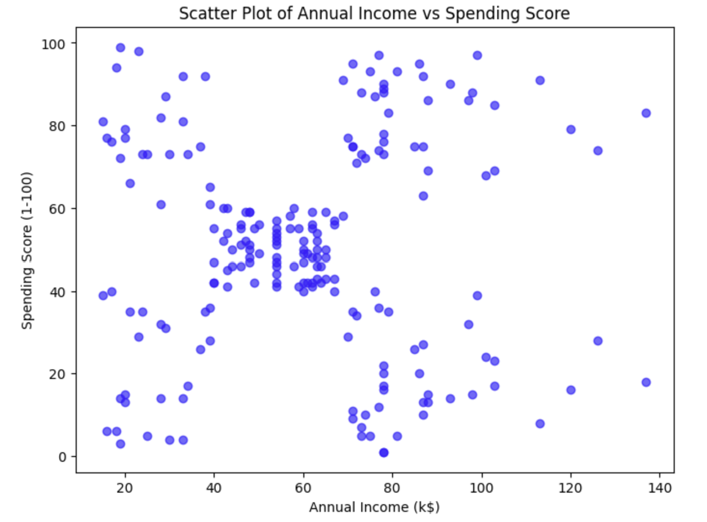
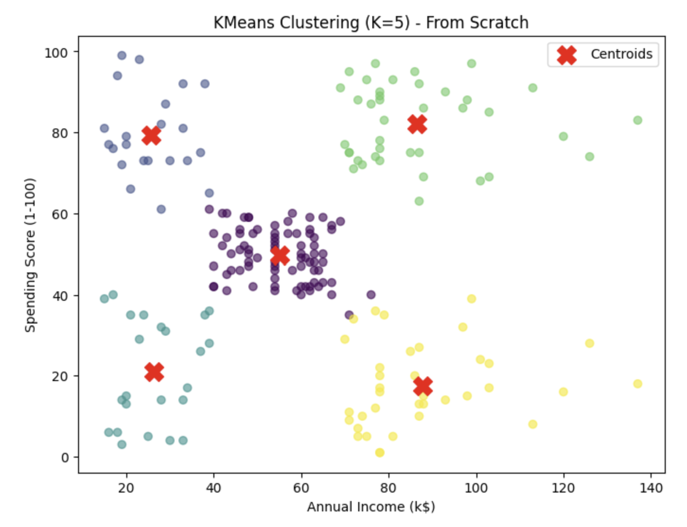

# Customer Segmentation Using K-Means Clustering

## Overview

This project applies the **K-Means Clustering** algorithm to the Mall Customers dataset to identify distinct customer groups based on their annual income and spending behavior.

Customer segmentation is widely used in marketing and business analytics to understand purchasing patterns, personalize marketing campaigns, and improve customer engagement.

The notebook demonstrates how unsupervised machine learning can be used to discover natural groupings within customer data without predefined labels.

---

# Objective

The objectives of this project are to:

- Apply the K-Means clustering algorithm to customer data.
- Segment customers based on purchasing behavior.
- Visualize customer clusters.
- Interpret the characteristics of each customer segment.

---

# Dataset

**Dataset:** Mall Customers

The dataset contains customer information collected by a shopping mall.

### Features Used

| Feature | Description |
|---------|-------------|
| Annual Income (k$) | Customer annual income |
| Spending Score (1–100) | Score assigned based on purchasing behavior |

Although additional customer information exists in the dataset, this analysis focuses on these two variables for clustering.

---

# Machine Learning Concepts

This notebook demonstrates:

- Unsupervised Learning
- K-Means Clustering
- Euclidean Distance
- Centroid Initialization
- Cluster Assignment
- Centroid Updating
- Iterative Optimization

---

# Methodology

The clustering workflow consists of the following steps:

1. Load the customer dataset.
2. Visualize the distribution of customers.
3. Select Annual Income and Spending Score as clustering features.
4. Randomly initialize cluster centroids.
5. Assign each customer to the nearest centroid using Euclidean distance.
6. Update centroid locations.
7. Repeat until convergence.
8. Visualize the final customer clusters and centroids.

---

# Analysis

## 1. Customer Distribution

The initial scatter plot illustrates the relationship between customer annual income and spending score before clustering.

### Visualization

### Interpretation

The scatter plot reveals that customer behavior is not uniformly distributed, suggesting the presence of natural customer groups that can be identified through clustering.

---

## 2. K-Means Clustering

The K-Means algorithm groups customers into **five clusters (K = 5)** based on similarity in annual income and spending score.

### Visualization

### Interpretation

The resulting clusters represent customer groups with distinct purchasing characteristics.

Examples may include:

- High Income – High Spending
- High Income – Low Spending
- Average Income – Average Spending
- Low Income – High Spending
- Low Income – Low Spending

These segments can support targeted marketing strategies and customer relationship management.

---

# Key Findings

- K-Means successfully identified five distinct customer groups.
- Customers with similar purchasing behavior were clustered together.
- Customer segmentation provides valuable insights for targeted promotions and personalized marketing.
- Annual Income and Spending Score are effective variables for identifying behavioral differences among customers.

---

# Skills Demonstrated

### Python

- Pandas
- NumPy
- Matplotlib

### Machine Learning

- K-Means Clustering
- Euclidean Distance
- Cluster Analysis
- Unsupervised Learning

### Data Analysis

- Data Visualization
- Feature Selection
- Customer Segmentation

---

# Technologies Used

- Python
- Pandas
- NumPy
- Matplotlib
- Jupyter Notebook

---

# Conclusion

This project demonstrates the practical application of K-Means clustering for customer segmentation. By grouping customers according to their income and spending behavior, the analysis highlights how unsupervised learning can uncover meaningful patterns without requiring labeled data.

The resulting customer segments can be used to support business decisions such as targeted marketing campaigns, customer personalization, and strategic resource allocation.