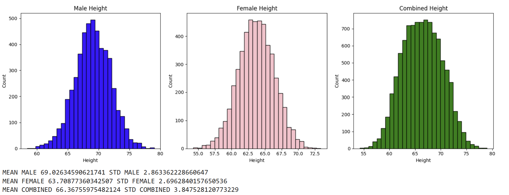
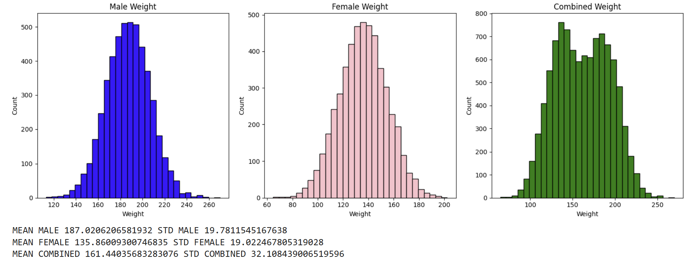

# Hypothesis Testing Using One-Sample T-Test | Height & Weight Dataset

## Overview

This project demonstrates the application of the **One-Sample T-Test** to determine whether randomly selected samples differ significantly from the population mean.

Using a dataset containing male and female height and weight measurements, the notebook explores descriptive statistics, visualizes data distributions, and performs hypothesis testing on randomly selected samples.

The project illustrates how statistical inference can be used to make conclusions about a population using only a sample.

---

# Objective

The objectives of this project are to:

- Explore the distribution of height and weight data.
- Compare male, female, and combined populations.
- Generate random samples from the population.
- Perform One-Sample T-Tests.
- Interpret hypothesis test results using the t-statistic and significance level (α).

---

# Dataset

**Dataset:** Height & Weight Dataset

The dataset contains measurements for male and female individuals.

### Variables Used

| Variable | Description |
|----------|-------------|
| Gender | Male / Female |
| Height | Height (inches) |
| Weight | Weight (pounds) |

The analysis is performed separately for:

- Male Population
- Female Population
- Combined Population

---

# Statistical Concepts

This notebook demonstrates:

- Descriptive Statistics
- Mean & Standard Deviation
- Random Sampling
- One-Sample T-Test
- Null & Alternative Hypotheses
- Significance Level (α)
- T-Statistic Interpretation
- Hypothesis Decision Making

---

# Methodology

The analysis follows these steps:

1. Load and inspect the dataset.
2. Separate observations by gender.
3. Calculate descriptive statistics (mean and standard deviation).
4. Visualize the distributions of height and weight.
5. Draw random samples from each population.
6. Perform One-Sample T-Tests.
7. Compare the calculated t-statistic against critical values.
8. Determine whether to reject or fail to reject the null hypothesis.

---

# Analysis

## 1. Exploratory Data Analysis

The notebook first explores the distribution of height and weight for male, female, and combined populations.

### Visualization

---

### Summary Statistics

The notebook calculates:

- Mean
- Standard Deviation

for each population to understand the central tendency and variability of the data.

---

## 2. One-Sample T-Test

Random samples are drawn from each population, and a One-Sample T-Test is performed.

The notebook evaluates:

- Male Population
- Female Population
- Combined Population

using a user-defined:

- Sample Size (n)
- Significance Level (α)

### Sample Output

### Example Result

For a sample size of **30** and **α = 0.05**, the notebook reports:

- Male Population → Fail to Reject H₀
- Female Population → Fail to Reject H₀
- Combined Population → Fail to Reject H₀

This indicates that the sampled observations do not differ significantly from their respective population means.

---

# Key Findings

- Height and weight distributions differ between male and female populations.
- Random samples produced sample means close to the population means.
- At α = 0.05, none of the One-Sample T-Tests provided sufficient evidence to reject the null hypothesis.
- Increasing the sample size generally results in a more stable estimate of the population mean and influences the t-statistic.

---

# Skills Demonstrated

### Python

- Pandas
- NumPy
- Matplotlib
- SciPy

### Statistics

- One-Sample T-Test
- Hypothesis Testing
- Random Sampling

### Data Analysis

- Data Visualization
- Distribution Analysis

---

# Technologies Used

- Python
- Pandas
- NumPy
- Matplotlib
- SciPy
- Jupyter Notebook

---

# Conclusion

This project demonstrates the practical application of the One-Sample T-Test for statistical inference using real-world height and weight data. Through descriptive statistics, visualization, random sampling, and hypothesis testing, the notebook illustrates how sample data can be used to draw conclusions about a population.

The project reinforces core statistical concepts such as significance testing, interpretation of the t-statistic, and evidence-based decision making.