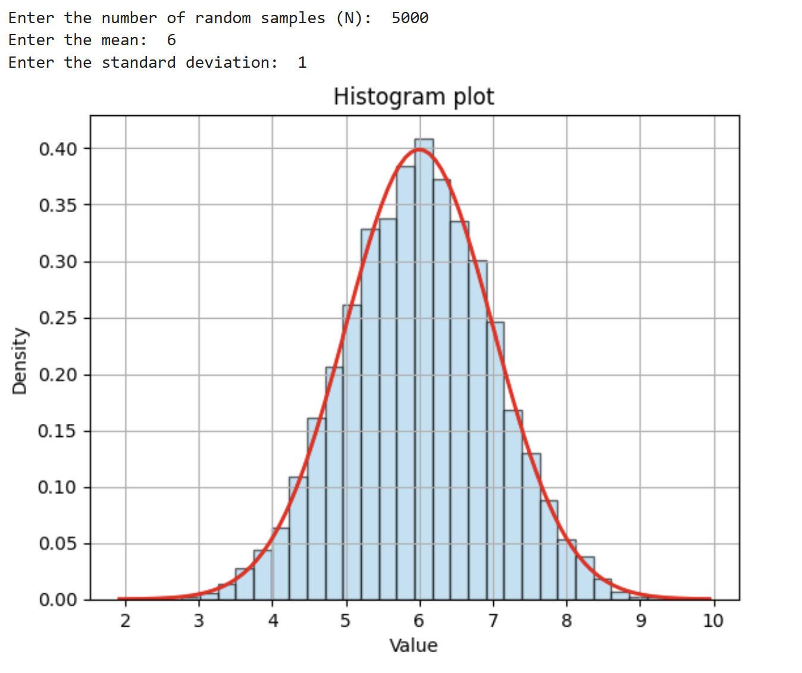
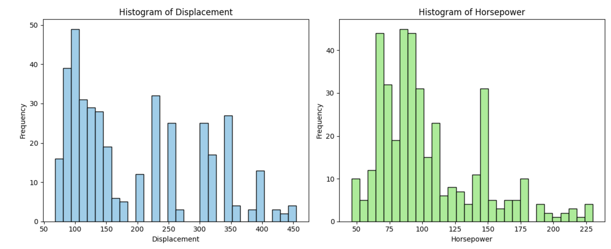

# Central Limit Theorem (CLT) Simulation

## Overview

This project demonstrates the **Central Limit Theorem (CLT)** through simulation and statistical analysis using Python.

The notebook explores how sample means behave under different probability distributions and illustrates one of the most fundamental concepts in statistics: regardless of the population distribution, the distribution of sample means approaches a normal distribution as the sample size increases.

In addition to the CLT simulation, the notebook performs descriptive statistical analysis on an automobile dataset to compare manually calculated statistics with Python library implementations.

---

# Objective

The objectives of this project are to:

- Simulate normally distributed random variables.
- Understand the Central Limit Theorem through repeated sampling.
- Compare population distributions with sampling distributions.
- Calculate descriptive statistics manually.
- Validate manual calculations using Python statistical libraries.

---

# Datasets

## 1. Simulated Data

Randomly generated datasets using NumPy's normal and uniform distributions.

## 2. Auto Dataset

The Auto dataset contains various automobile characteristics.

### Variable Used

| Variable | Description |
|----------|-------------|
| Displacement | Engine displacement of the vehicle |

---

# Statistical Concepts

This notebook demonstrates:

- Central Limit Theorem
- Sampling Distribution
- Random Sampling
- Normal Distribution
- Uniform Distribution
- Descriptive Statistics
- Mean
- Median
- Standard Deviation
- Skewness
- Kurtosis

---

# Methodology

The notebook consists of three independent analyses.

---

# Analysis

## 1. Normal Distribution Simulation

Random samples are generated from a normal distribution using different sample sizes to observe how the distribution behaves.

### Sample Sizes

- N = 100
- N = 1000
- N = 5000

Each simulation visualizes the generated observations together with the theoretical normal probability density function.

### Visualization

### Interpretation

As the sample size increases, the histogram more closely approximates the theoretical normal distribution, demonstrating the effect of larger sample sizes on distribution stability.

---

## 2. Descriptive Statistics Validation

Using the Auto dataset, descriptive statistics are calculated manually and then compared with SciPy implementations.

### Statistics Calculated

- Mean
- Median
- Standard Deviation
- Skewness
- Kurtosis

### Visualization

### Results

The manually calculated statistics closely match those produced by the statistical libraries, validating the implementation.

---

## 3. Central Limit Theorem Simulation

A population of **100,000 observations** is generated from a **uniform distribution**, which is intentionally non-normal.

Repeated random samples are then drawn from the population, and the mean of each sample is recorded.

Parameters used:

- Population Size = 100,000
- Sample Size = 30
- Number of Samples = 10,000

### Visualization 

### Results

The simulation demonstrates that:

- The original population follows a uniform distribution.
- The distribution of sample means closely resembles a normal distribution.
- The average of the sample means closely approximates the theoretical population mean.

Example Output

| Metric | Value |
|---------|------:|
| Theoretical Mean | 50.00 |
| Sample Mean | 50.31 |
| Sample Standard Deviation | 5.25 |

---

# Key Findings

- Larger sample sizes produce distributions that better approximate the theoretical normal distribution.
- Manual statistical calculations agree with established Python statistical libraries.
- Despite sampling from a uniform population, the distribution of sample means becomes approximately normal.
- The simulation provides empirical evidence supporting the Central Limit Theorem.

---

# Skills Demonstrated

### Python

- NumPy
- Pandas
- Matplotlib
- SciPy

### Statistics

- Central Limit Theorem
- Sampling Distribution
- Distribution Analysis
- Random Sampling

### Data Analysis

- Statistical Simulation
- Exploratory Data Analysis
- Visualization
- Statistical Validation

---

# Technologies Used

- Python
- NumPy
- Pandas
- SciPy
- Matplotlib
- Jupyter Notebook

---

# Conclusion

This project demonstrates the Central Limit Theorem through simulation while reinforcing key concepts in descriptive statistics and probability distributions.

By comparing manually calculated statistics with Python libraries and illustrating how sample means converge toward a normal distribution, the notebook provides a practical understanding of statistical inference and one of the foundational principles of modern statistics.