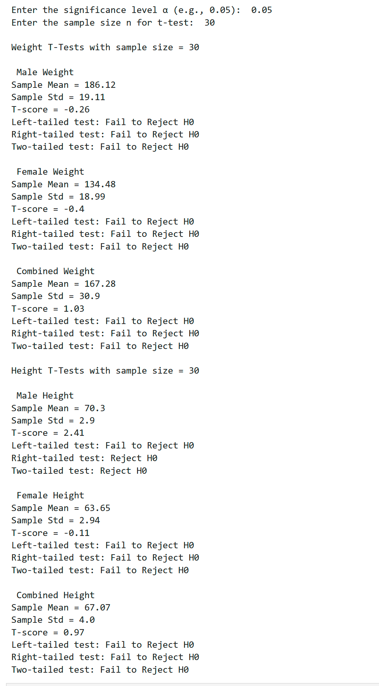
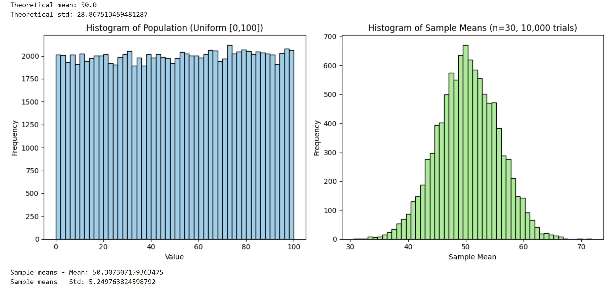

# Python Statistical Analysis

A collection of statistical analysis and machine learning projects implemented in **Python** to explore core concepts in statistical inference, hypothesis testing, probability, and unsupervised learning.

Using real-world datasets and simulation techniques, this repository demonstrates how statistical methods can be applied to analyze data, validate hypotheses, uncover hidden patterns, and support data-driven decision-making.

---

# Project Overview

This repository contains four independent statistical analysis projects that progressively cover fundamental topics in statistics and machine learning.

The projects combine theoretical concepts with practical implementation using Python libraries such as **NumPy**, **Pandas**, **SciPy**, and **Matplotlib**, emphasizing both statistical reasoning and data visualization.

---

# Project Highlights

- Performed **Chi-Square Tests of Independence** to evaluate relationships between categorical variables.
- Implemented **K-Means Clustering** to identify customer segments using unsupervised machine learning.
- Applied **One-Sample T-Tests** to compare sample statistics with population parameters.
- Simulated the **Central Limit Theorem (CLT)** to demonstrate how sampling distributions converge toward normality.
- Visualized statistical distributions, hypothesis testing results, and machine learning outputs.

---

# Project Gallery

## Chi-Square Test

---

## K-Means Customer Segmentation

---
## One-Sample T-Test

---
## Central Limit Theorem Simulation

# Repository Structure

| Project | Description |
|----------|-------------|
| [`Central Limit Theorem Simulation`](./4_Central_Limit_Theorem_Simulation) | Demonstrates sampling distributions and validates the Central Limit Theorem through simulation. |
|  [`Hypothesis Testing`](./3_HeightWeight_Ztest_Ttest) | Performs One-Sample T-Tests using real-world height and weight data. |
| [`Chi-Square Test`](./1_Chi_Square_Test_Titanic) | Evaluates relationships between categorical variables using the Titanic dataset. |
|  [`K-Means Clustering`](./2_MallCustomers_KMeans) | Segments mall customers based on income and spending behavior using unsupervised learning. |

Each project contains its own README explaining the methodology, implementation, statistical concepts, results, and conclusions.

---

# Skills Demonstrated

### Python

- Pandas
- NumPy
- Matplotlib
- SciPy

### Statistics

- Central Limit Theorem
- Descriptive Statistics
- Hypothesis Testing
- One-Sample T-Test
- Chi-Square Test
- Statistical Inference
- Probability Distributions
- Sampling Theory

### Machine Learning

- K-Means Clustering
- Customer Segmentation
- Unsupervised Learning

### Data Analysis

- Exploratory Data Analysis (EDA)
- Data Visualization
- Statistical Simulation
- Interpretation of Statistical Results

---

# Technologies Used

| Category | Technology |
|----------|------------|
| Programming Language | Python |
| Data Analysis | Pandas |
| Numerical Computing | NumPy |
| Scientific Computing | SciPy |
| Visualization | Matplotlib |
| Development Environment | Jupyter Notebook |

---

# Conclusion

This repository demonstrates the practical application of fundamental statistical and machine learning techniques using Python.

Through simulation, hypothesis testing, categorical analysis, and clustering, the projects showcase how statistical methods can be used to understand data, validate assumptions, and extract meaningful insights.

Together, these projects provide a strong foundation in statistical analysis and illustrate the role of Python as a versatile tool for data science and analytical problem-solving.